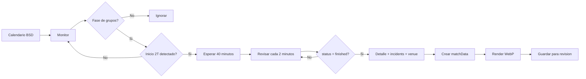

# Flujo Automatico V1 - Marcador Final Fase De Grupos

## Objetivo

Generar automaticamente una imagen de marcador final cuando termine un partido de fase de grupos del Mundial 2026.

Esta version no publica automaticamente en X/Twitter. Solo genera la imagen y la deja lista para revision.

## Agentes Involucrados

1. Agente De Datos Mundial 2026.
2. Agente Monitor De Resultados.
3. Agente De Renderizado De Imagenes.
4. Agente De Fidelidad Figma.

## Secuencia

## Regla De Monitoreo

- Solo fase de grupos.
- No revisar fuerte desde kickoff.
- Detectar inicio de segundo tiempo.
- Contar 40 minutos desde inicio de segundo tiempo.
- Revisar cada 2 minutos.
- Al detectar final, generar imagen una sola vez.

## Fuente Principal

BSD Football API:

- `league_id=27`
- `season_id=188`
- `GET /api/v2/events/`
- `GET /api/v2/events/live/`
- `GET /api/v2/events/{id}/`
- `GET /api/v2/events/{id}/incidents/`
- `GET /api/v2/venues/{venue_id}/`

## Salida

Archivo WebP:

`outputs/generated/{fecha}_{grupo}_{home}-{score}-{away}.webp`

Ejemplo:

`outputs/generated/2026-06-13_group-c_brazil-1-1-morocco.webp`

## Siguiente Agente

Cuando esta V1 genere imagenes correctamente, crear o activar:

`Agente De Autoposting X/Twitter`

Ese agente se encargara de:

- Preparar texto del post.
- Adjuntar imagen.
- Publicar automaticamente o pedir aprobacion.
- Evitar duplicados.
- Manejar errores/rate limits de X.
